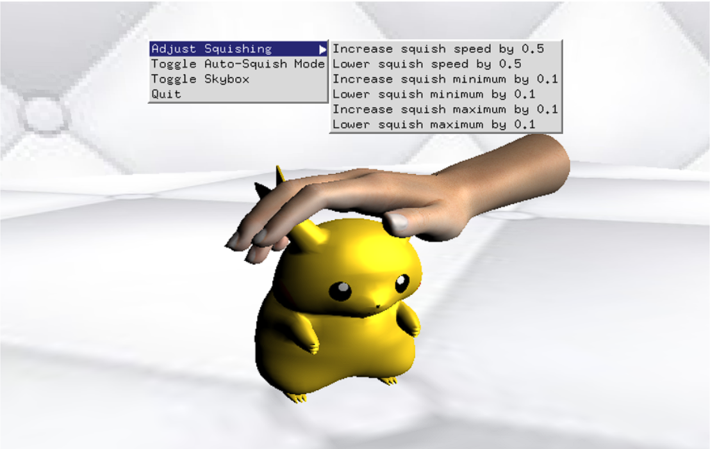
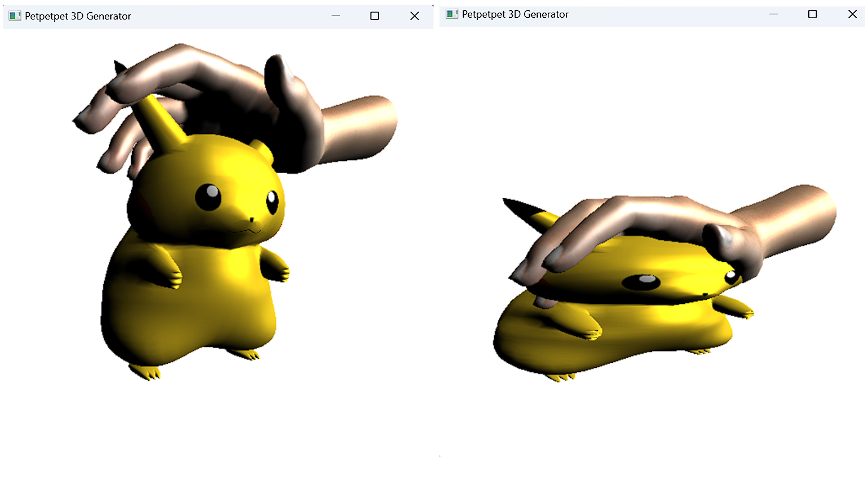

# COMP3009-Project

This project aims to simulate the action of ‘petting’ a chosen 3D object with a hand in a 3D environment. The action of petting the object would distort it in various ways, and the user is able to adjust how the object is distorted, the intensity of the distortion, and the speed at which it happens. The project idea is inspired by a tool named “petpet generator”, which takes an input image and generates a gif of a hand petting the image: https://benisland.neocities.org/petpet/. The interesting part of the tool is how the image gets ‘squished’ in the generated animation. The idea behind this project is to achieve a similar function but in 3D space. Thus, this distortion will work on any 3D model that is imported by the user. The program should also act as a model viewer, in which the user can rotate the camera around the model and zoom in/out.

# Development

This project uses C++, OpenGL, and GLSL. It features its own custom model importing, rendering and shaders.

# Screenshots

# Models

The 3D models used are for testing purposes and not created by us. They are from these websites:
https://sketchfab.com/3d-models/female-hand-3e9b8ad1942048e3a267d92fb1124d46
https://sketchfab.com/3d-models/fat-pikachu-89dfdd5c1aa2458385dfdc327e418b19
https://sketchfab.com/3d-models/pikachu-6ff719b49e754e3f888f4a429f5e499a
https://sketchfab.com/3d-models/haggord-hagrid-hd-remake-joke-25d5631b99ac45dc9b6786a4a6333899